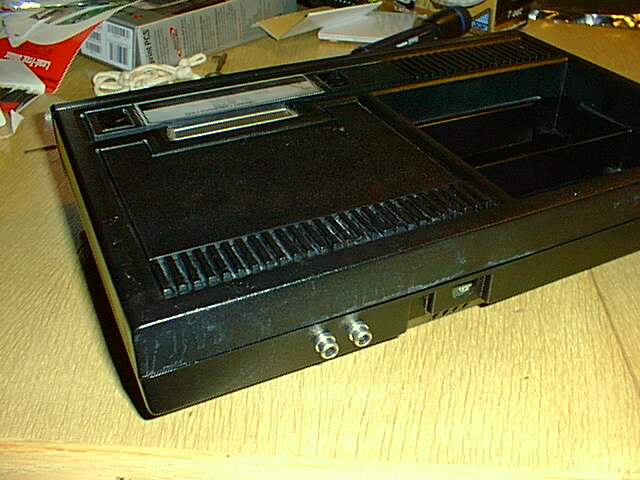

This simple mod was made using a RadioShack "dual general-purpose ic pc board"
(cat. no. 276-159B), an LM318 opamp (which radioshack apparently doesn't carry),
some resistors and capacitors, and some cut-up RCA patch cables.  

[Instructions are here](howto.html).

[Video amp schematic](sch.html)

[Circuit layout](pcb.html)
