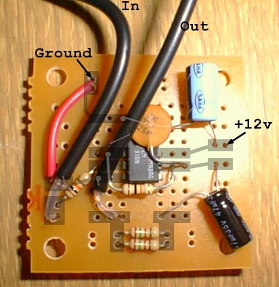

I made this video amplifier while attempting to add RCA [audio/video jacks to a
ColecoVision](index.html), and while not really knowing what I was doing. This
is mostly here for posterity.

the video amp board requires the following parts:

 - circuit board of some sort 
   (pictured: 1/2 of a radio shack "dual general-purpose ic pc board" 
    cat. no. 276-159B)
 - some wire (22 gauge stranded wire is recommended)
 - LM318N (IC1)
 - 2x 10k resistors (R1,R2)
 - 2x 150 ohm resistors (R3,R4)
 - 27pF capacitor (C1)
 - &gt;1uF capacitor (C2 - see <a href="sch.html">schematic</a>)
 - 47uF capacitor (C3)

[Video amp schematic](sch.html)
